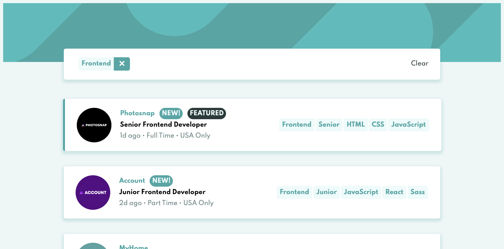
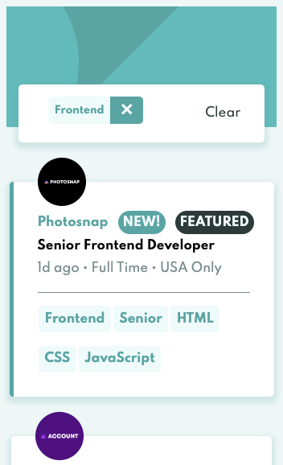

# Frontend Mentor - Job listings with filtering solution

This is a solution to the [Job listings with filtering challenge on Frontend Mentor](https://www.frontendmentor.io/challenges/job-listings-with-filtering-ivstIPCt). Frontend Mentor challenges help you improve your coding skills by building realistic projects.

## Table of contents

- [Overview](#overview)
  - [The challenge](#the-challenge)
  - [Screenshot](#screenshot)
  - [Links](#links)
- [My process](#my-process)
  - [Built with](#built-with)
  - [What I learned](#what-i-learned)
  - [Continued development](#continued-development)
  - [Useful resources](#useful-resources)
- [Author](#author)
- [Acknowledgments](#acknowledgments)

**Note: Delete this note and update the table of contents based on what sections you keep.**

## Overview

### The challenge

Users should be able to:

- View the optimal layout for the site depending on their device's screen size
- See hover states for all interactive elements on the page
- Filter job listings based on the categories

### Screenshot




Add a screenshot of your solution. The easiest way to do this is to use Firefox to view your project, right-click the page and select "Take a Screenshot". You can choose either a full-height screenshot or a cropped one based on how long the page is. If it's very long, it might be best to crop it.

Alternatively, you can use a tool like [FireShot](https://getfireshot.com/) to take the screenshot. FireShot has a free option, so you don't need to purchase it.

Then crop/optimize/edit your image however you like, add it to your project, and update the file path in the image above.

**Note: Delete this note and the paragraphs above when you add your screenshot. If you prefer not to add a screenshot, feel free to remove this entire section.**

### Links

- Solution URL: [GitHub Repository](https://github.com/MrOlivo/react-job-listings)
- Live Site URL: [GitHubPages](https://mrolivo.github.io/react-job-listings/)

## My process

After reading the style guide and creating the React app, I spent the majority of the time making sure all the functional elements worked before starting any styling. The complex part came at to implementing styled components and their _weird_ classnames syntax.

### Built with

- [React](https://reactjs.org/) - JS library
- [Styled Components](https://styled-components.com/) - For styles
- Flexbox (super heplful for **Jobs** Component)

### What I learned

This was my first solo React with styled-components and I learned an incredible amount about both of those packages. From React, it was great to code an application that used hooks and functional components. And from styled components, the exercise of converting html tags to named components was fun and challenging.

I've learned how to pass props to a styled component. I founded useful for add the horizontal line indicating a _feature_ job.

```jsx
const JobContainer = styled.div`
  ...
  border-left: ${(props) => props.size}px solid rgb(90, 164, 164);
  ...
`;
```

Also, i've learned how to do component heritage.

Original component

```jsx
export const Badge = styled.span`
  color: ${COLOR_SCHEME.SECONDARY};
  background-color: ${COLOR_SCHEME.PRIMARY};
  border-radius: 1rem;
  padding: 0.4rem;
  text-transform: uppercase;
  margin-right: 0.8rem;
`;
```

Component that inherits

```jsx
export const Featured = styled(Badge)`
  background-color: ${COLOR_SCHEME.SECONDARY_DARKEST};
`;
```

### Continued development

This was a great exercise in React and styled-components and I will continue to focus on projects like this to keep get more experience in both of these... along with flexbox, JavaScript, and CSS. In particular, I will focus on CSS. I really hate CSS, for my its syntax is a _bit_ complex.

### Useful resources

- [Styled Components](https://styled-components.com/docs) - Oficial Styled Component documentation.
- [YouTube](https://www.youtube.com) - To all peaple who also did this challenge. I've learned a lot from them. I'm not an CSS expert, so I watched a lot of videos trying to copy their work, besides learning from their experience solving this challenge.

## Author

- Website - [Lic. Edwin Olivo](https://www.your-site.com)
- Frontend Mentor - [@MrOlivo](https://www.frontendmentor.io/profile/MrOlivo)
- GitHub - [MrOlivo](https://github.com/MrOlivo)

## Acknowledgments

This is where you can give a hat tip to anyone who helped you out on this project. Perhaps you worked in a team or got some inspiration from someone else's solution. This is the perfect place to give them some credit.
